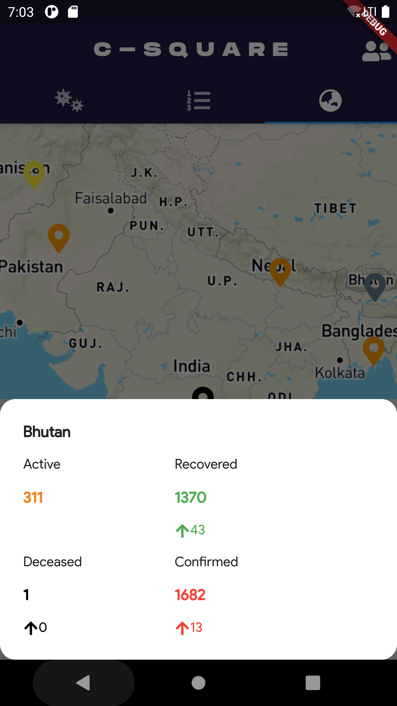

C-Square

C Square stands for Covid-Counter

Application for Dynamic Representation of Real Time Corona Cases Across the World in the form of graph and maps

Sample Images:

# Screenshots

## Carosel

## Welcome

## About

## Graphs

## Home

## List

## Map

