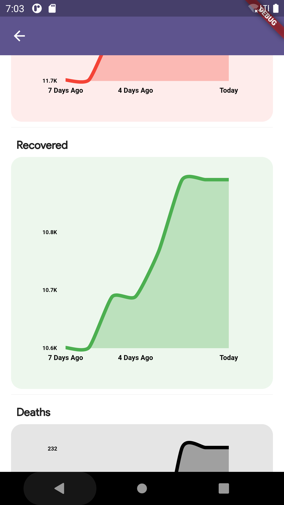
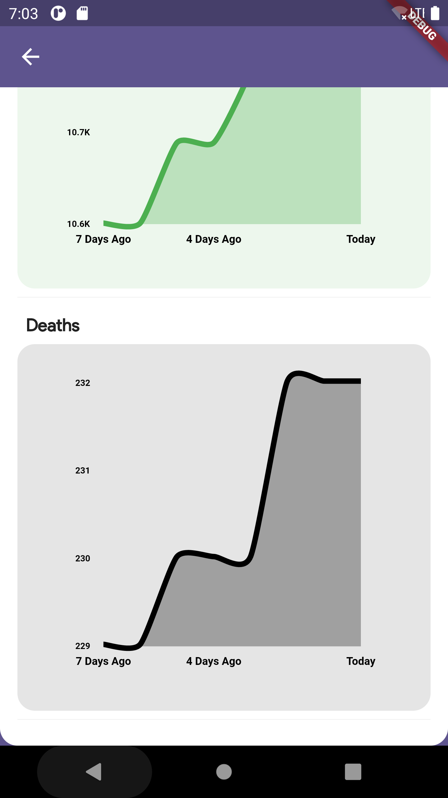
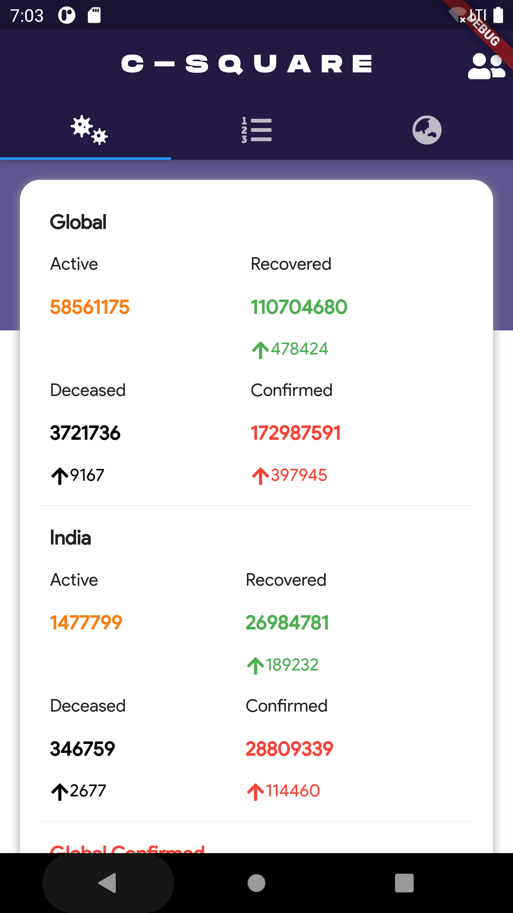
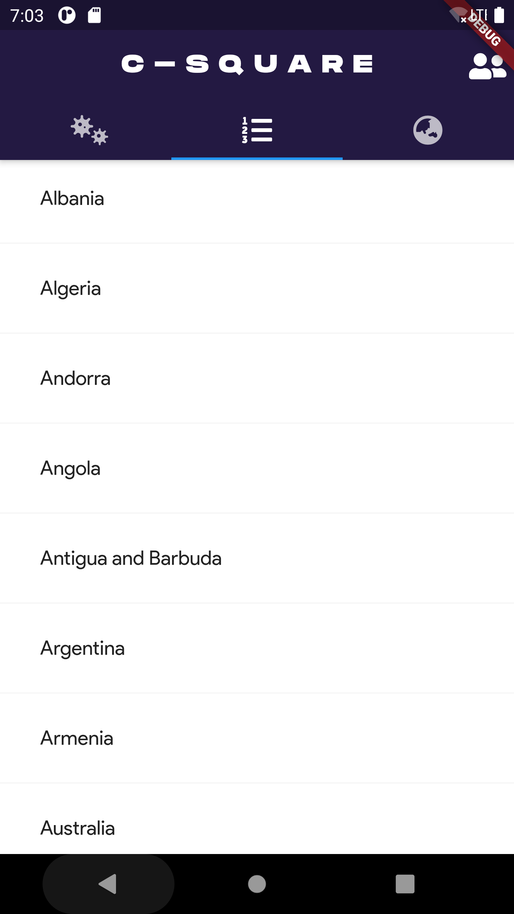
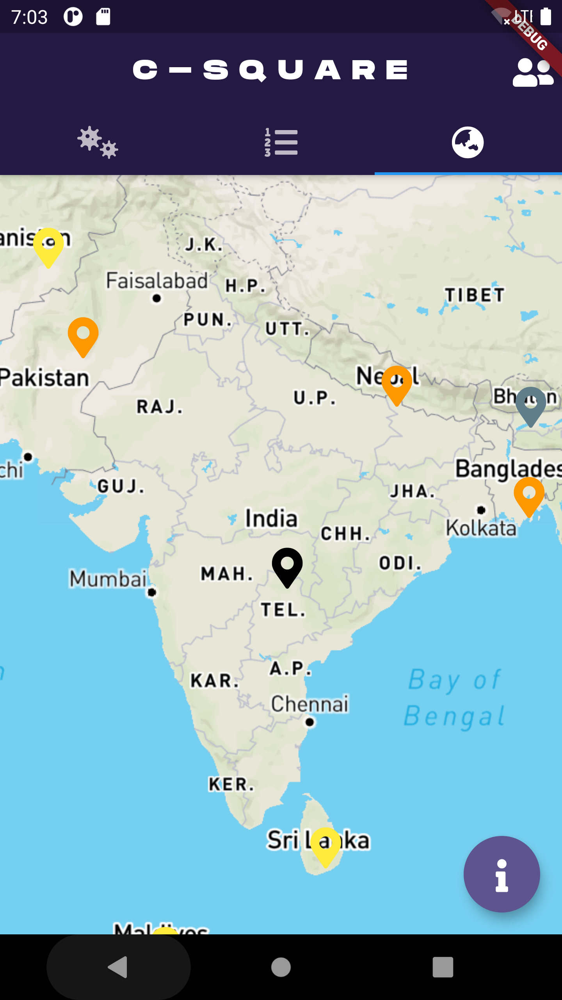

C-Square

C Square stands for Covid-Counter

Application for Dynamic Representation of Real Time Corona Cases Across the World in the form of graph and maps

Sample Images:

# Screenshots

<!-- Row 1 -->
  

<!-- Row 2 -->
  

<!-- Row 3 -->
  

<!-- Additional Rows -->
<!-- Add more rows if needed -->
